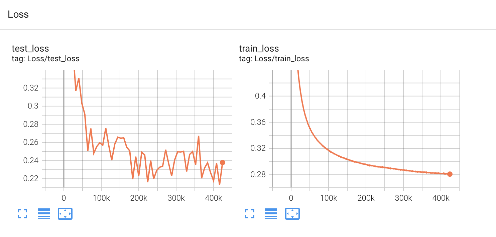

# SimpleTransfromerTTS

This is toy implementation of transformer tts: https://arxiv.org/pdf/1809.08895.pdf

Main simplifications:
- without tokenizer
- without scaled pos-encoding 
- without vokoder, only Griffin-Lim 

Train time: ~1 day on V100



## Example output:

- [hello_world](assets/hello_world.mp3)
- [london is the capital](assets/london.mp3)

## Inference:
- Weighs: [train_SimpleTransfromerTTS.pt](https://drive.google.com/file/d/12CZIP-tLFcteT2RRfG6__w3_T47m-QJK/view?usp=sharing)

```python
import IPython
import torch

from model import TransformerTTS
from melspecs import inverse_mel_spec_to_wav
from write_mp3 import write_mp3


train_saved_path = "<your-path>/train_SimpleTransfromerTTS.pt"
state = torch.load(train_saved_path)
model = TransformerTTS().cuda()
model.load_state_dict(state["model"])

text = "Hello, World."
name_file = "hello_world.mp3"


postnet_mel, gate = model.inference(
  text_to_seq(text).unsqueeze(0).cuda(),
  gate_threshold=1e-5,
  with_tqdm = False
)

audio = inverse_mel_spec_to_wav(postnet_mel.detach()[0].T)

plt.plot(
    torch.sigmoid(gate[0, :]).detach().cpu().numpy()
)

write_mp3(
    audio.detach().cpu().numpy(),
    name_file
)

IPython.display.Audio(
    audio.detach().cpu().numpy(),
    rate=hp.sr
)
```

## Train 
- Dowload [wavs](https://www.kaggle.com/datasets/mathurinache/the-lj-speech-dataset)
- Dowload [metafiles](https://www.kaggle.com/datasets/tttzof351/ljspeech-meta)
- Edit paths `csv_path`, `wav_path`, `save_path`, `log_path` in [hyperparams.py](hyperparams.py)
- Run `python train.py`
